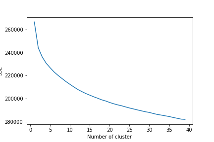

# opportunity-recommendation-engine
## Recommendation engine for oppurtunity 

 
 ### Build a recommendation engine

- Given  dataset of opportunities, cluster them based on relevant semantic meanings
Example: If there is an opportunity for computer science students and another opportunity related to Machine Learning, they should be clustered closer together, when compared with a Social Sciences opportunity

-  Given a dataset of user preferences, recommend opportunities from the opportunity dataset 
 ### Tech Stack and Requirement :
  - nltk
  - pandas
  - numpy 
  - matplotlib
  - seaborn
  - sklearn
  
-- download weights from here and place it in same repo:
https://www.kaggle.com/watts2/glove6b50dtxt

## Clustering Part : Problem Statement 1
  -  First Iteration: 
Tried to make Feature based Engineering part where i tried to make all features, through the features , also made sub features like splitting the labels to su labels. All the labeled features , are being transvered into learning model of KMEANS with an optimised K - means++ algo , with k=10.

   - Second Model: 
Used Transfer learning and knowledge bases for having sentiment analysis of each and every word in the dataset.
Employed **Glove.6B.50d** text data knowledge for getting 50 dimensional vector for every word.
We have Included **cosine similarity** system to draw similarity between words meaning and sentiment.

## Recommendation engine : Problem Statement 2
  - Using TF-IDF (Term Frequency-Inverse Document Frequency)
For recommendation Engine we employed TF-IDF vectorisation based system that are used in information retrieval for feature extraction purposes. 

  - now comes a more general content based recommendation part:

Firstly, for a new profile we will be matching the opportunity and person profile on the basis of, Discipline, Minimum qualification and country in which the candidate is located.

from this, we can recommend the new user by using the matching score,

for our user once he or she have selected an opportunity we will be fetching the selected results and monitor for other factors into account like funding, subtags, location of opportunity and fine-tune my results on base of these
and also first and second matching will go hand in hand

USER PROFILES:

TOP 5 RECOMMENDATIONs: AS we can see user_id 2 has been recommended with opportunity IDs as shown in image below 

## Look at the Data Set : 
Data set created using scraping of opportunities from various sites using web scraping techniques. 

